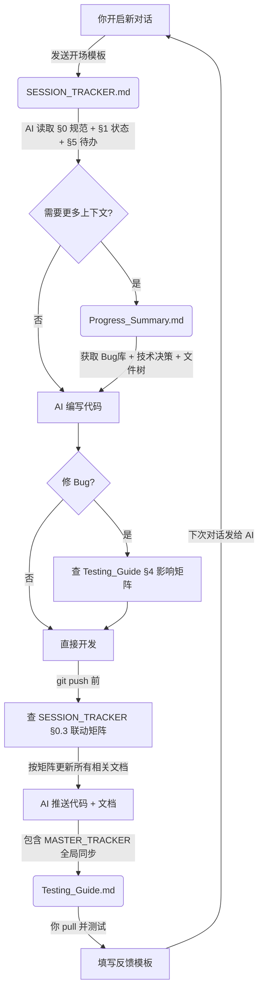

# MarioTrickster

> **非对称对抗平台跳跃游戏 (Asymmetric Multiplayer Platformer)**
> 
> 一名玩家扮演闯关者（类似马里奥）克服障碍到达终点；另一名玩家扮演捣蛋者，伪装成关卡中的障碍物、地形或怪物阻止闯关者。

---

## 📚 核心协作文档导航 (AI Collaboration Docs)

本项目采用 **6 文档体系 + 联动更新矩阵**，每条信息只有一个“真相源”文档，其他文档只引用不重复。详见 `SESSION_TRACKER.md` §0.3 联动更新矩阵。

| 🎯 你的目标 | 📄 应该看哪个文档？ | 🤖 AI 会看吗？ |
|:---|:---|:---|
| **开启新对话 / 提交测试反馈** | 👉 [**SESSION_TRACKER.md**](./SESSION_TRACKER.md) | **每次对话必读入口** |
| **纵览全局：设计规划 vs 实现进度** | 👉 [**MASTER_TRACKER.md**](./MASTER_TRACKER.md) | AI 自动同步更新 |
| 查阅所有历史Bug、功能清单、文件结构 | 👉 [**MarioTrickster_Progress_Summary.md**](./MarioTrickster_Progress_Summary.md) | AI 按需深度读取 |
| 怎么在 Unity 里测试？键位是什么？ | 👉 [**MarioTrickster_Testing_Guide.md**](./MarioTrickster_Testing_Guide.md) | 用户测试手册 |
| Git报错了？怎么提问最省积分？ | 👉 [**AI_WORKFLOW.md**](./AI_WORKFLOW.md) | 用户工作流指南 |
| 游戏设计初衷、平衡性、美术风格 | 👉 [**GAME_DESIGN.md**](./GAME_DESIGN.md) | 项目初期/迷失时查阅 |

---

## 🔄 AI 协作工作流图解

---

## 🚀 快速启动

**如果你是人类开发者：**
1. 克隆本仓库：`git clone https://github.com/jiaxuGOGOGO/MarioTrickster.git`
2. 使用 Unity 2022.3 LTS 打开项目
3. 阅读 [测试指南](./MarioTrickster_Testing_Guide.md) 了解如何一键生成测试场景

**如果你是 AI 助手：**
1. 请立即读取 [SESSION_TRACKER.md](./SESSION_TRACKER.md) 获取最新状态和本次任务
2. 在积分接近警戒线时，务必优先更新文档并推送代码
3. 推送前必须执行 `SESSION_TRACKER.md` §0.3 联动更新矩阵，确保所有文档同步
