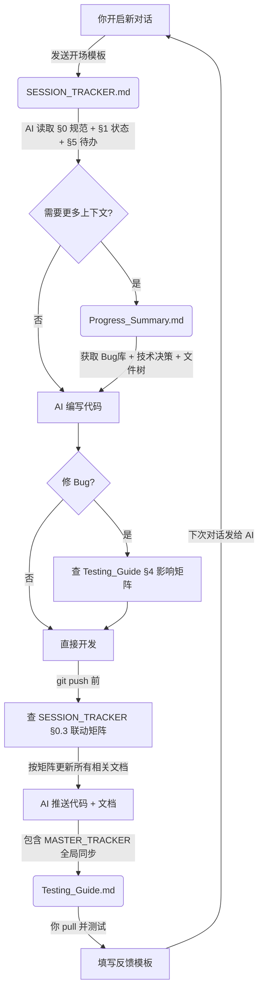

# MarioTrickster

> **非对称对抗平台跳跃游戏 (Asymmetric Multiplayer Platformer)**
> 
> 一名玩家扮演闯关者（类似马里奥）克服障碍到达终点；另一名玩家扮演捣蛋者，伪装成关卡中的障碍物、地形或怪物阻止闯关者。

---

## 📚 核心协作文档导航 (AI Collaboration Docs)

本项目采用 **6 文档体系 + 联动更新矩阵**，每条信息只有一个“真相源”文档，其他文档只引用不重复。详见 `SESSION_TRACKER.md` §0.3 联动更新矩阵。

| 🎯 你的目标 | 📄 应该看哪个文档？ | 🤖 AI 会看吗？ |
|:---|:---|:---|
| **开启新对话 / 提交测试反馈** | 👉 [**SESSION_TRACKER.md**](./SESSION_TRACKER.md) | **每次对话必读入口** |
| **纵览全局：设计规划 vs 实现进度** | 👉 [**MASTER_TRACKER.md**](./MASTER_TRACKER.md) | AI 自动同步更新 |
| 查阅所有历史Bug、功能清单、文件结构 | 👉 [**MarioTrickster_Progress_Summary.md**](./MarioTrickster_Progress_Summary.md) | AI 按需深度读取 |
| 怎么在 Unity 里测试？键位是什么？ | 👉 [**MarioTrickster_Testing_Guide.md**](./MarioTrickster_Testing_Guide.md) | 用户测试手册 |
| Git报错了？怎么提问最省积分？ | 👉 [**AI_WORKFLOW.md**](./AI_WORKFLOW.md) | 用户工作流指南 |
| 游戏设计初衷、平衡性、美术风格 | 👉 [**GAME_DESIGN.md**](./GAME_DESIGN.md) | 项目初期/迷失时查阅 |

---

## ⚡ 新对话极速续接与美术白话入口总表

如果你的目标是**换号 / 换窗口后直接续上，不想中途再补条件**，推荐把**仓库地址、可用 token、当前任务**一次给全。这样 AI 可以先读档，再在需要时直接提交与推送；如果这轮最终没有写回仓库，token 只是备用，不影响执行。

> **默认极速续接模板**
>
> ```text
> 我换号了，要继续上次项目。
> 仓库地址：https://github.com/你的用户名/你的仓库
> token：<你的可用 token>
> 本次任务：[你的当前需求]
> 请先读档接上当前进度继续，并按项目效率与质量优先原则处理；凡是形成可复用结论的内容，都要落库并在完成后推送。
> ```

| 续接 / 生产入口 | AI 后端默认识别 | 是否必须落库 | 默认落到哪 | 何时自动 push |
|---|---|---|---|---|
| **我想从零开始做这套美术资产，你带我走。** | 阶段判定 / 主路线选择 | **是** | `SESSION_TRACKER.md` | 一旦主路线或“下一步最缺项”明确 |
| **我上传了一本教程，帮我蒸馏进配方库并推送仓库。** | 喂书蒸馏 / 规则入库 | **是** | `prompts/PROMPT_RECIPES.md` + `SESSION_TRACKER.md` | 蒸馏规则完成入库并记录 recap 后 |
| **按这个参考风格，先在本地给我跑 30 张探索图，我拿去炼 LoRA。** | 风格探索 / 训练集积累 | **是** | `SESSION_TRACKER.md` | 出现可复用风格方向、锚点 Seed、负面禁区、筛图结论后 |
| **我要用 Civitai 练这个 LoRA，直接告诉我页面每一项怎么填。** | 在线训练参数填写 / 排障 | **是** | `SESSION_TRACKER.md` | 参数定版，或排障后得到可复用修正方案后 |
| **这个 LoRA 练完了，告诉我怎么在本地验证触发词、权重和污染。** | 本地验证 / 甜区测试 / 污染排查 | **是** | `SESSION_TRACKER.md` + `prompts/PROMPT_RECIPES.md` 顶部名录 | 测出推荐权重、污染症状、专属去污词后 |
| **我炼完 LoRA 了，文件名是 A，触发词是 B。帮我登记。** | LoRA 入库登记 | **是** | `prompts/PROMPT_RECIPES.md` 顶部名录 + `SESSION_TRACKER.md` | 文件名与触发词确认、资产卡生成后 |
| **做一组地刺的静态图。** | 正式量产派单 / 四区图纸生成 | **是** | `SESSION_TRACKER.md`，必要时并入 `prompts/PROMPT_RECIPES.md` 相关区域 | 四区图纸、关键参数、ControlNet 路线、锚点或禁区可复用后 |

| 续接规则 | 现在的默认要求 |
|---|---|
| **读档是否需要 token** | **不绝对需要**；只读仓库内容时，仓库地址通常足够 |
| **提交 / 推送是否需要 token** | **通常需要可用认证**；若当前环境认证失效，就必须补 token |
| **推荐默认做法** | **新对话开场就统一提供仓库地址 + token + 当前任务**，避免中途打断 |
| **完成判定** | **未落库不算完成；需要跨对话稳定续接时，未 push 不算真正存档** |

---

## 🔄 AI 协作工作流图解



---

## 🚀 快速启动

**如果你是人类开发者：**
1. 克隆本仓库：`git clone https://github.com/jiaxuGOGOGO/MarioTrickster.git`
2. 使用 Unity 2022.3 LTS 打开项目
3. 阅读 [测试指南](./MarioTrickster_Testing_Guide.md) 了解如何一键生成测试场景

**如果你是 AI 助手：**
1. 请立即读取 [SESSION_TRACKER.md](./SESSION_TRACKER.md) 获取最新状态和本次任务
2. 在积分接近警戒线时，务必优先更新文档并推送代码
3. 推送前必须执行 `SESSION_TRACKER.md` §0.3 联动更新矩阵，确保所有文档同步
