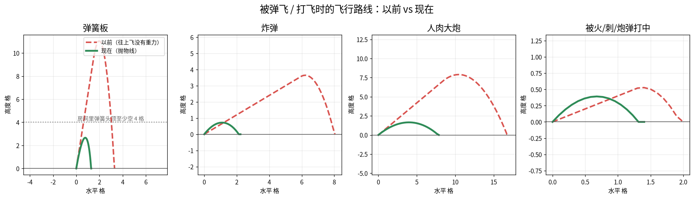

# S216 机关手感 / 视觉全面检查：被弹飞有抛物线、受伤有冲击、连锁看得见因果

## 用户问题
"检查目前项目的机关机制还有技能道具特殊场景和角色是否合理的视觉效果 比如弹跳跳跃是否合理 等 大炮击中人的效果等等 还有人物收到伤害是否合理 整体考虑全部检查一遍 然后参考行业优秀做法 可以在github参考进行优化 陷进联动视觉效果和联动效果也是合理符合视觉效果 不会让人觉得生硬突兀不自然"

## 审计发现（按严重程度）
| # | 问题 | 原因 | 表现 |
|---|---|---|---|
| 1 | **被弹飞时往上没有重力**（根本 bug） | 马里奥/捣蛋者"受击硬直"期间只在往下掉时加重力 | 弹簧 0.6 秒匀速上飘 9–11 格（房间头顶只空 5–8 格 → 撞天花板）；炸弹横推 8 格飘 3.6 格；人肉炮飞 17 格；像在月球上 |
| 2 | 受伤只有半透明闪烁 | 没有冲击点 | 被火/刺/炮弹打中"没感觉"，分不清是被打了还是无敌 |
| 3 | 预警抖动每帧随机跳、闪烁频率不变 | Random.Range 每帧 | 看着抽搐；看不出"马上要来了" |
| 4 | 震屏每帧随机 | Random.insideUnitCircle | 画面抖得脏，尾巴收不干净 |
| 5 | 铁笼瞬移落下、绳套一帧把人拉上 1.5 格 | 直接改坐标 | 生硬、突兀 |
| 6 | 连锁远处的机关"自己动了" | 没有因果提示 | 玩家看不懂是谁引发了谁 |
| 7 | 炮弹/爆炸/弹簧没有冲击画面 | 只有消失/变速 | 爆炸范围看不见（H3 可读性） |

## 行业做法（只借规则）
| 来源 | 借来的规则 | 落地 |
|---|---|---|
| Smash Bros 击飞 https://www.ssbwiki.com/Knockback | 被击飞全程受重力、轨迹是可预判抛物线，硬直有专门的下落 | `Step1Feel.StunStep`：硬直期全程重力 40（平时 80，更有滞空感）+ 空中阻力 + 落地摩擦 |
| Celia Wagar《Stunning Detail》https://critpoints.net/2016/08/14/stunning-detail/ | 击退距离（pushback）与硬直共同决定"读得懂" | 受伤小跳 0.4 格、后退 1.6 格；炸飞 0.7 格高 2.5 格远 |
| Vlambeer《The art of screenshake》https://www.youtube.com/watch?v=AJdEqssNZ-U / Juice it or lose it https://www.youtube.com/watch?v=Fy0aCDmgnxg | 命中要有冲击点、粒子、震屏，但因果要看得见 | 冲击环、尘土、碎屑、炮口火光、后坐力、连锁火花线 |
| Squirrel Eiserloh《Juicing Your Cameras With Math》https://gdcvault.com/play/1023146/Math-for-Game-Programmers-Juicing | 震屏用平滑噪声，强度按剩余比例平方衰减 | `Step1Feel.ShakeOffset` |
| 动画原则"预备动作" | 发动前越来越急 | 预警闪烁频率 1× → 2.5×；炸弹/油桶最后鼓起来 |

## 改了什么
- 物理：`MarioController` / `TricksterController` 硬直分支改用 `Step1Feel.StunStep`（全程重力 + 落地检测）；被弹上天的（弹簧、炸飞、人肉炮）**落地才恢复控制**（最多多等 1.5 秒，H9）；香蕉皮落地不刹车（就是要滑）。
- 数值（RushMarioTuning v18，旧资产自动补）：launchGravity 40、launchAirDrag 2、launchGroundFriction 40、launchLandGraceSeconds 1.5、springLaunchSpeed 16→15、hurtLift 6、blastLift 8、hurtHitFlashSeconds 0.18、juiceFx 开。
- 画面（`Step1Fx`，纯画面，不碰碰撞/物理，马里奥 AI 不读——H4；同屏上限 90 个）：
  - 弹簧板：板子压下→弹出→阻尼回弹 + 尘土 + 绿色冲击环
  - 大炮：炮口火光 + 烟 + 炮管后坐；炮弹碎裂冲击点 + 碎片；打中人震屏
  - 炸弹/油桶：冲击环 = 爆炸半径（看得见范围）+ 火星 + 黑烟；引信最后鼓起来；离爆心越近飞越远
  - 受伤：红白快闪 0.18 秒 + 头顶星星，之后是原来的无敌闪烁
  - 铁笼加速落下 0.12 秒 + 落地尘土震屏；绳套 0.25 秒缓动吊起 + 轻晃
  - 裂缝地板碎块下落；绊线崩断；香蕉皮打滑火星；重落地扬尘
  - 连锁：上一环 → 下一环一道火花导火线
  - 预警：频率越来越快 + 平滑抖动；震屏平滑
- 构建器 BuilderVersion 20（弹簧速度写进场景，旧房间自动重建）。

## 刻意没做（避免矫枉过正）
- 没改任何机关的判定、伤害、时长、预警时长（H3 不变）；没改马里奥 AI。
- 没加粒子插件/着色器（Feel、DOTween 等）：运行时方块精灵足够，美术接入后替换 `Step1Fx` 即可。
- 没改平时跳跃（80 重力、半重力顶点等 S32/S36 已是 Celeste 式好手感）。

## 验证
- sim S216：用游戏同一份 `Step1Feel` 模拟 5 种弹飞 → 弹簧 高2.7远1.3｜炸弹 高0.7远2.5｜人肉炮 高1.7远10.0｜炮弹 高0.4远2.4｜火/刺 高0.4远1.6（以前弹簧 0.6 秒上飘 9 格）。弹高 < 头顶空 4 格规则。
- EditMode（需在 Unity 跑）：S216_LaunchArcsHaveGravityAndFitRooms、S216_VisualCurvesAreSmoothAndReadable、S216_Wiring；更新了旧的弹簧弹高测试。
- 需要你在 Unity 确认：实际观感（颜色/大小/多少合不合口味）；觉得特效太多 → RushMarioTuning 里取消勾选 juiceFx。

